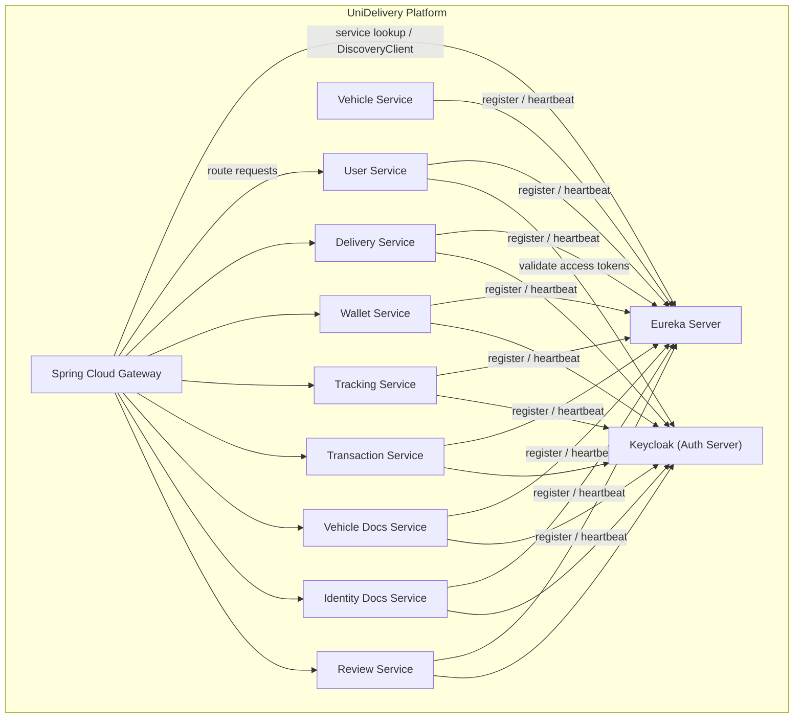

## UniDelivery – Eureka Server

The **Eureka Server** is the **service discovery server** for the UniDelivery microservices platform.  
It acts as a **central registry** where all other backend services (gateway, user, vehicle, delivery, wallet, tracking, etc.) register themselves and from which they discover each other.

---

### 1. Technology Stack

- **Runtime**: Java 17  
- **Framework**: Spring Boot `4.0.2`  
- **Cloud**: Spring Cloud `2025.1.1`  
- **Discovery**: `spring-cloud-starter-netflix-eureka-server`

The main entry point is `EurekaApplication`:

```startLine:endLine:src/main/java/com/uniDelivery/eureka/EurekaApplication.java
package com.uniDelivery.eureka;

import org.springframework.boot.SpringApplication;
import org.springframework.boot.autoconfigure.SpringBootApplication;
import org.springframework.cloud.netflix.eureka.server.EnableEurekaServer;

@SpringBootApplication
@EnableEurekaServer
public class EurekaApplication {

    public static void main(String[] args) {
        SpringApplication.run(EurekaApplication.class, args);
    }

}
```

---

### 2. Responsibilities

- **Service Registry**
  - Maintains a registry of all registered UniDelivery microservices.
  - Exposes the registry to Eureka clients for service-to-service communication.
- **Health-Based Registration**
  - Tracks registered instances and removes those that fail to send heartbeats.
- **Dashboard**
  - Provides a web UI to inspect registered instances and their status.

---

### 3. Runtime Configuration

Current configuration (`application.properties`):

```startLine:endLine:src/main/resources/application.properties
spring.application.name=eureka

server.port=8761

eureka.client.register-with-eureka=false
eureka.client.fetch-registry=false
eureka.server.enable-self-preservation=false

eureka.dashboard.enabled=true
```

- **Application name**: `eureka`
- **Port**: `8761`
  - Dashboard: `http://localhost:8761/`
- **Standalone server mode**:
  - `register-with-eureka=false` and `fetch-registry=false` mean this instance is a **pure server** and does not act as a client.
- **Self-preservation**:
  - `eureka.server.enable-self-preservation=false` disables self-preservation (aggressive removal of instances when heartbeats stop).  
    In production, carefully assess this setting to avoid accidental mass-eviction during network issues.

---

### 4. Running the Eureka Server

- **Using Maven**

```bash
mvn spring-boot:run
```

- **Using the packaged JAR**

```bash
mvn clean package
java -jar target/eureka-server-0.0.1-SNAPSHOT.jar
```

After startup, open the dashboard:

```text
http://localhost:8761/
```

---

### 5. Registering UniDelivery Microservices (Clients)

Each UniDelivery microservice (**gateway**, **user**, **vehicle**, **delivery**, **wallet**, **tracking**, **transaction**, **vehicle-docs**, **identity-docs**, **review**, etc.) should act as a **Eureka client**:

- **Maven dependency (in each client service)**:

```xml
<dependency>
    <groupId>org.springframework.cloud</groupId>
    <artifactId>spring-cloud-starter-netflix-eureka-client</artifactId>
</dependency>
```

- **Typical client configuration (example)**:

```properties
spring.application.name=user-service

eureka.client.service-url.defaultZone=http://localhost:8761/eureka/
eureka.instance.prefer-ip-address=true
```

This allows:

- **Gateway** to resolve backends (user, delivery, wallet, etc.) by logical service ID.
- **Backend services** to call each other using logical names instead of hard-coded host/port.

---

### 6. UML – Component View

The following UML-style component diagram (using **Mermaid**) shows how the Eureka Server fits into the overall UniDelivery architecture.



**Notes**:

- Only the **Eureka Server** is implemented in this module.  
- The other components are shown to clarify how this service participates in the wider UniDelivery microservices ecosystem.

---

### 7. Operational Considerations

- **High availability**
  - For production, consider running multiple Eureka instances behind a load balancer and configuring peer replication.
- **Security**
  - When integrating with the secured environment (Keycloak, OAuth2), protect the Eureka dashboard and registry endpoints (e.g., via network-level controls or Spring Security).
- **Monitoring**
  - Integrate with Spring Boot Actuator and your monitoring stack to track:
    - Eureka server health
    - Registration counts and churn
    - Dashboard access

